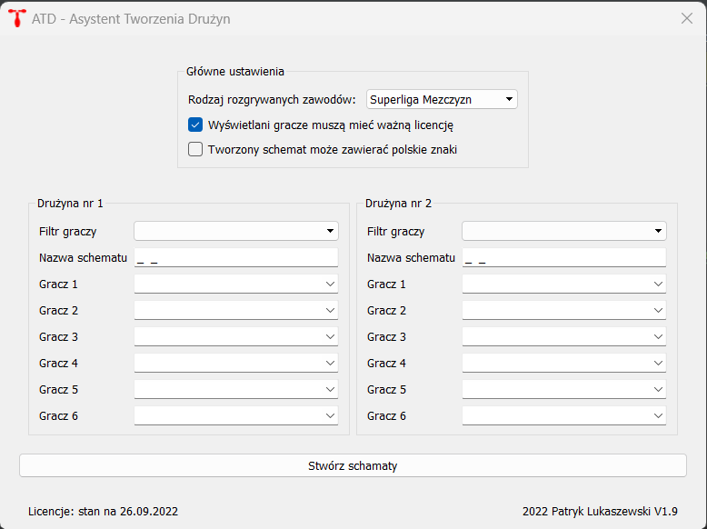

# O aplikacji
- Python 3.4 (aby działałą na Windows XP)

# Przeznaczenie aplikacji
Aplikacja w przejrzysty sposób (ma listę rozwijaną z graczami poszczególnych drużyn) tworzy pliki zawierające graczy, którzy będą grali w meczu kręglarskim. 

# Dlaczego aplikacja powstała
Ponieważ w aktualnym programie na kręgielni, który jest odpowiedzialny za uruchomienie meczu, nie ma możliwości szybkiego wybrania zawoników, bo program jest mało intuicjny. Ale przy użyciu mojego skryptu zostaną stworzone pliki tektowe, które następnie program na kręgielni może wczytać.

# Wygląd aplikacji
